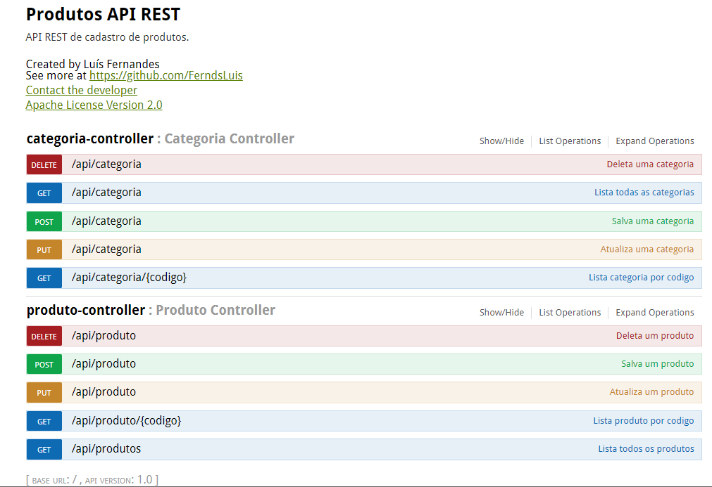

# 
API com Spring Boot 

  

Objetivo do projeto:

- Desenvolver uma API Rest com framework Spring Boot.
- API possui duas chamadas, uma de categoria e outra de produto
- Foi utilizado o Swagger para detalhar as chamadas (http://localhost:8080/swagger-ui.html)
- O banco de dados é em memória H2
- API não faz tratamento de exceção.
- Foi utilizado devtools

  

## Front End:

https://github.com/FerndsLuis/frontend_produtosCategoria_crud

## Features

- [x] Cadastro de Categoria/Produtos
- [x] Atualização de Categoria/Produtos
- [x] Edição de Categoria/Produtos
- [x] Exclusão de Categoria/Produtos

## Ferramentas utilizadas

- Java 11
- Spring BooT
- Spring Tool Suite 4+ - IDE
- JPA

## Como clonar?

    git clone https://github.com/FerndsLuis/backend_produtosCategoria_crud.git
